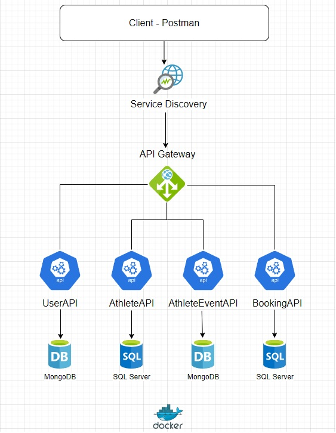
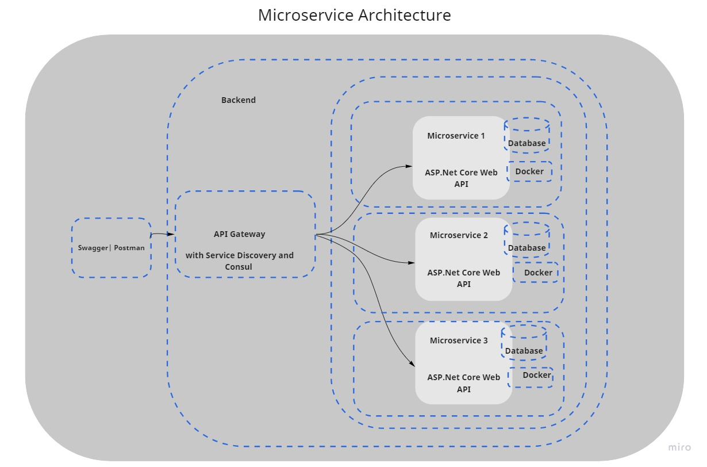

## FullStackAthleteApp

## Problem Statement
In this project you are required to create the backend system of `FullStackAthleteApp`.
There are 2 type of users are there in system - User & Admin. You need to implement role based security to secure endpoints from unauthorized users. Identify the appropiate endpoints for admin & user and apply the security.

* A `FullStackAthleteApp` is a microservice based web API and frontend application, 
  build a ASP.Net  Core Web APIs with Microservice architecture with angular as client 
  i.e frontend application

* Backend Mircoservices with ASP.Net core Web APIs use Postman and swagger for 
  API endpoint evaluation

  
  

* ***Tech Stack***
1. C#
2. .NET Core 3.1 Web API
3. XUnit Testing
4. Angular 13
5. Swagger or Postman
6. Docker

***Backend APIs Required***
1. UserAPI
Expected Model for UserAPI
```
- Id
- EmailId
- Username
- Password
- ConfirmPassword
- Role
- CountryCode
- CountryName
- DialCode
- Phonenumber
- Status
- Date
```
2. AthleteAPI
Expected Model for AthleteAPI
```
- AthleteId
- Name 
- Height 
- Weight 
- City
- Country
- Category
- ImageURL
- Status
- Date
```

3. AthleteEventAPI
Expected Model for AthleteEventAPI
```
- Id
- Name
- Logo
- ContactNo
- ContactAddress
- IsBlocked
```

4. BookingAPI
Expected Model for BookingAPI
```
- Id
- EmailID
- AthleteEventNo { get; set; }
- AthleteEventAttendees
- Status  //Not Started, Started, Completed, Cancelled
```
5. GatewayAPI

# 1. UserAPI REST API End Points Required

* POST----------> api/v1.0/User/register
* POST----------> api/v1.0/User/login
* GET-----------> api/v1.0/User/getAllUsers
* GET-----------> api/v1.0/User/getUserById/{id}
* PUT-----------> api/v1.0/User/updateUserPassword
* PUT-----------> api/v1.0/updateUser/{id}
* PUT-----------> api/v1.0/User/blockUserById/{id}/{status}

# 2. AthleteAPI REST API End Points Required

* GET-----------> api/v1.0/Athlete/getAllAthletes/{excludeLoggedInAthlete}
* GET-----------> api/v1.0/Athlete/getAllAthletes/
* GET-----------> api/v1.0/Athlete/getAllUnblockedAthletes
* GET-----------> api/v1.0/Athlete/getAllCategories
* GET-----------> api/v1.0/Athlete/getAthleteById/{id}
* GET-----------> api/v1.0/Athlete/getAthleteByName/{name}
* GET-----------> api/v1.0/Athlete/getAthleteByCategory/{category}

* POST----------> api/v1.0/Athlete/addAthlete
* PUT-----------> api/v1.0/Athlete/blockAthleteById/{id}/{status}


# 3. AthleteEventAPI REST API End Points Required

* POST----------> /api/v1.0/AthleteEvent/AthleteEvent/register
* POST----------> /api/v1.0/AthleteEvent/inventory/add
* GET-----------> /api/v1.0/AthleteEvent/allAthleteEvents
* GET-----------> /api/v1.0/AthleteEvent/search
* DELETE--------> /api/v1.0/AthleteEvent/deleteAthleteEventByName
* UPDATE--------> /api/v1.0/blockAthleteEvent/{name}

# 4. BookingAPI REST API End Points Required
* POST ----------> /api/v1.0/booking/Addbooking
* GET------------> /api/v1.0/booking/history/{email}
* DELETE-------->  /api/v1.0/booking/cancel/{bookingdetail}
* GET----------->  /api/v1.0/booking/getAllBookings/

# 5. GatewayAPI use Ocelot Gateway 

***Frontend Required***
1. Angular 13
 
### Project structure

The folders and files you see in this repositories, is how it is expected to be in projects, which are submitted for automated evaluation by Hobbes

    Project
	|
	├── UserService                          // This is the microservice for User Authentication
	├── AthleteService                       // This is the microservice for Athlete Service  
	├── AthleteEventService                  // This is the microservice for AthleteEventService  
	├── BookingService                       // This is the microservice for BookingService     
  ├── AtheleteUI                       //Angular Project which consume all the above APIs endpoints 
  ├── .gitignore                       // This file contains a list of file name that 
                                          are supposed to be ignored by git


## Mandatory Specifications for Building Solution
```
- Application data must be stored in Database.
- Application should use swagger as API documentation tool.
- Application should have seperate data access layer (Repository) which performs all database 
  related operations.
- Application should have seperate service layer (Services) which performs other business 
  operations such as handling exceptions.
- Application should have API gateway. All endpoints should be called through API gateway only.
- All services must be registered through Consul Service Discovery.
- Role based authentication to be done using JWT Authentication.
- Unit testing for back end is compulsory.
- Swagger Implementation for documenting REST APIs is compulsory
- Application must be dockerized.

```


 


